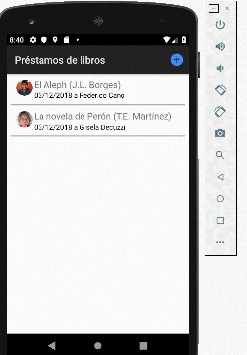
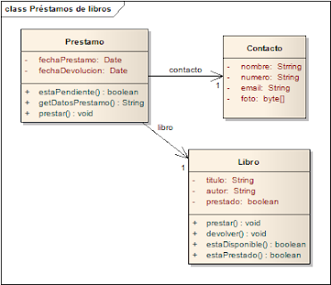

# Préstamos de libros

Desarrollar una aplicación que permita hacer un seguimiento de los libros que prestamos a nuestros contactos.

## El proyecto

Este proyecto está generado para

* Android Studio 3.2.1 (Noviembre 2018)
* con Gradle 3.2.1 (el que viene con Android Studio)
* para una SDK 28 (Pie)
* en Kotlin (hay que descargarlo siguiendo [estos pasos](https://kotlinlang.org/docs/tutorials/kotlin-android.html))
* aprovechamos las [Kotlin Android Extensions](https://antonioleiva.com/kotlin-android-extensions/)

## Explicación

Esta aplicación es la más completa de todas:

* accede a la lista de contactos del dispositivo, tanto para recuperarlos como para agregar
* tiene una vista principal list para mostrar los préstamos,
* y un menú que se activa con un click largo sobre un elemento, que permite
  * devolver el libro
  * o contactar a quien nos debe el libro por mail o llamándolo
* también podemos crear un préstamo, para lo cual hay un formulario con validaciones
* y por último, la aplicación se puede configurar para hacerse persistente en la base interna del dispositivo (SQLite)

## El modelo

Nuestro dominio es bastante sencillo:

### Decisiones a tomar

* los contactos ¿salen del dispositivo o tendremos una entidad aparte? Lo más razonable es que el objeto Contacto esté asociado a los que cargamos en nuestro dispositivo, pero esta es una decisión que hay que consensuar con el usuario.
* ¿dónde guardamos los préstamos? ¿necesitaremos identificadores unívocos?
* ¿cómo navegar la aplicación?

## Explicaciones adicionales

* [Actividad principal: lista de préstamos](documentation/listaPrestamos.md)