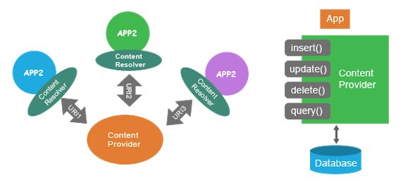
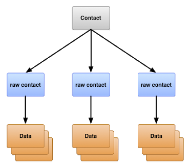
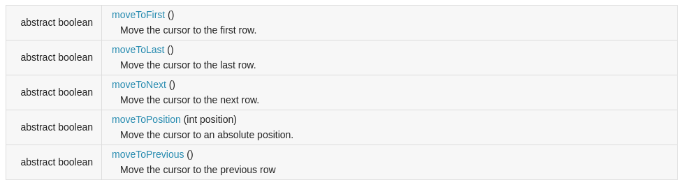
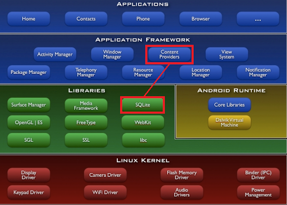
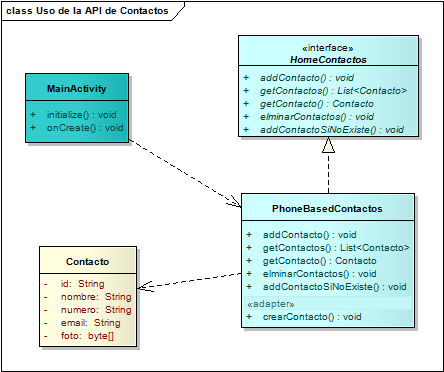
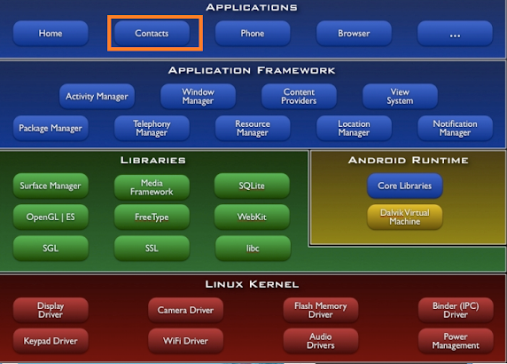

# Interacción con API Contactos

## Nuestro objetivo

Vamos a integrar la lista de contactos de la aplicación con la API ContentProvider que permite utilizar la lista de contactos del dispositivo.

Es importante

* ver los contactos que hay
* saber si un contacto existe
* crear nuevos contactos
* eliminar los contactos

mmm... una interfaz típica de un home. Definimos una interfaz RepoContactos con una implementación PhoneBasedRepoContactos.

## ContentProvider de Android



El ContentProvider es el equivalente a un Home/Repo con operaciones atómicas (insert, update, delete y query). La buena noticia es que no hay que liberar recursos porque la conexión es local a la actividad. Tenemos varios tipos de ContentProviders, para diferentes usos

* contactos, la que vamos a usar
* el diccionario de palabras que usa el corrector ortográfico,
* el calendario de eventos,
* la configuración,
* el repo donde están los archivos multimedia como videos o fotos, etc.

Para más información: 

* http://developer.android.com/guide/topics/providers/content-provider-basics.html
* http://developer.android.com/guide/topics/providers/contacts-provider.html

## ContentResolver

Es el cliente que accede a ese ContentProvider, con el que podemos disparar consultas y actualizaciones.

## Vista principal: llamando al Bootstrap

En la vista principal MainActivity llamamos a PrestamosBootstrap que le pide a un repo que incorpore contactos si no existen...

```kt
    override fun onCreate(savedInstanceState: Bundle) {
        ...
        PrestamosAppBootstrap(this)
```

PrestamosAppBootstrap es un **Singleton**, que en Kotlin se implementa como [object](https://kotlinlang.org/docs/reference/object-declarations.html):

```kt
class PrestamosAppBootstrap(activity: MainActivity) {

    init {
        /**
         * inicializamos la información de la aplicación
         */
        val repoContactos = PrestamosConfig.repoContactos(activity)
        repoContactos.addContactoSiNoExiste(
                Contacto("1", "46425829", "Chiara Dodino", "kiki.dodain@gmail.com", ImageUtil.convertToImage(activity, "kiarush.png"))
        )
```

En la inicialización del objeto delegamos la creación en el repositorio de contactos, que sale de la configuración de la aplicación (otro singleton PrestamosConfig). 

## API de Contactos de Android

Un contact identifica a una persona, que puede tener diferentes formas de ser contactada. Cada una de estas formas es lo que se guarda en el "Raw Contact" (amigo, compañero de facultad, compañero de trabajo, etc.) Esto permite agrupar a una persona en diferentes roles, sobre todo cuando sincronizamos los contactos desde diferentes orígenes:

* Outlook del trabajo
* Gmail
* otro teléfono
* etc.

A su vez cada raw contact tiene n datos (representado por la entidad Data), donde el formato varía en base a la información que se almacena:

* un número de teléfono de la casa o móvil
* un mail corporativo de trabajo o de contacto
* una foto
* una cuenta de facebook
* una cuenta de twitter

Cada uno de estos datos representa un registro en la entidad Data, incluso podemos tener muchos teléfonos, o cuentas de twitter asociadas al mismo raw contact.



## Implementación del repositorio de contactos de Android

### Instanciación

Ahora que sabemos cómo es la estructura de los contactos vamos al Home, en el método addContacto recibimos un objeto Contacto (del dominio de nuestra aplicación) y creamos un Contact de Android.

```kt
/**
 * actividad (página) madre que permite hacer consultas sobre los contactos
 */
class PhoneBasedContactos(var parentActivity: Activity) : RepoContactos {

    override fun addContactoSiNoExiste(contacto: Contacto) {
        if (this.getContacto(contacto) == null) {
            this.addContacto(contacto)
        }
    }
```

El repositorio no es del todo “transparente”, ya que necesita una Activity para tener una referencia al content resolver que le permite consumir la API de contactos. Entonces hay un alto acoplamiento entre los concerns de UI y estos orígenes de datos.

### Generación de un contacto

Vemos cómo se crea un contacto, generando un raw contact y varios data, por cada tipo de información que tiene el contacto:

```kt
    override fun addContacto(contacto: Contacto) {
        val tipoCuenta : String? = null
        val nombreCuenta : String? = null

        /** CON BUILDERS */
        val comandosAgregar : ArrayList<ContentProviderOperation> = ArrayList()
        // Fuerza a usar ArrayList!
        comandosAgregar.add(ContentProviderOperation.newInsert(ContactsContract.RawContacts.CONTENT_URI)
            .withValue(ContactsContract.RawContacts.ACCOUNT_TYPE, tipoCuenta)
            .withValue(ContactsContract.RawContacts.ACCOUNT_NAME, nombreCuenta)
            .build()
        );
        comandosAgregar.add(ContentProviderOperation.newInsert(ContactsContract.Data.CONTENT_URI)
            .withValueBackReference(ContactsContract.Data.RAW_CONTACT_ID, 0)
            .withValue(ContactsContract.Data.MIMETYPE, ContactsContract.CommonDataKinds.StructuredName.CONTENT_ITEM_TYPE)
            .withValue(ContactsContract.CommonDataKinds.StructuredName.DISPLAY_NAME, contacto.nombre)
            .build()
        );
        comandosAgregar.add(ContentProviderOperation.newInsert(ContactsContract.Data.CONTENT_URI)
            .withValueBackReference(ContactsContract.Data.RAW_CONTACT_ID, 0)
            .withValue(ContactsContract.Data.MIMETYPE, ContactsContract.CommonDataKinds.Phone.CONTENT_ITEM_TYPE)
            .withValue(ContactsContract.CommonDataKinds.Phone.NUMBER, contacto.numero)
            .withValue(ContactsContract.CommonDataKinds.Phone.TYPE, ContactsContract.CommonDataKinds.Phone.TYPE_HOME)
            .build()
        );
        comandosAgregar.add(ContentProviderOperation.newInsert(ContactsContract.Data.CONTENT_URI)
            .withValueBackReference(ContactsContract.Data.RAW_CONTACT_ID, 0)
            .withValue(ContactsContract.Data.MIMETYPE, ContactsContract.CommonDataKinds.Email.CONTENT_ITEM_TYPE)
            .withValue(ContactsContract.CommonDataKinds.Email.ADDRESS, contacto.email)
            .build()
        );
        comandosAgregar.add(ContentProviderOperation.newInsert(ContactsContract.Data.CONTENT_URI)
            .withValueBackReference(ContactsContract.Data.RAW_CONTACT_ID, 0)
            .withValue(ContactsContract.Data.MIMETYPE, ContactsContract.CommonDataKinds.Photo.CONTENT_ITEM_TYPE)
            .withValue(ContactsContract.CommonDataKinds.Photo.PHOTO, contacto.foto)
            .build()
        )
        parentActivity.contentResolver.applyBatch(ContactsContract.AUTHORITY, comandosAgregar)
    }
```

Como curiosidad para el lector, se trabaja con builders agrupando una serie de comandos que se ejecutan todos en una misma transacción. Otra opción es agregar la información de cada contacto en forma individual, pero tiene cierta degradación de performance.

### Contact vs. Contacto

Como decisión de diseño decidimos tener nuestro propio objeto Contacto, que esconde la complejidad de la API de contactos de Android simplificándolo en un objeto con los datos necesarios para nuestra aplicación: nombre, teléfono, mail y foto.

Para más información puede verse

* http://stackoverflow.com/questions/4144193/import-contacts-from-vcf-file-in-android-2-1
* http://stackoverflow.com/questions/7330165/how-to-access-contacts-in-my-android-program
* http://stackoverflow.com/questions/13814786/display-the-contacts-in-sorting-order-contactscontract-contacts-of-content-resol

### Búsqueda de un contacto

Queremos hacer un search by example, por número de teléfono o bien por nombre, aquí vemos cómo esa complejidad se esconde en el home a favor de la Activity que envía el mensaje getContacto utilizando como parámetro la abstracción Contacto. Si quiere buscar por número, pasa un contacto con un número específico, si quiere buscar por nombre, guarda en la propiedad nombre del contacto el valor a buscar:

```kt
    override fun getContacto(contactoOrigen: Contacto): Contacto //? 
    {
        val lookupUri : Uri
        if (contactoOrigen.numero != null) {
            lookupUri = Uri.withAppendedPath(ContactsContract.PhoneLookup.CONTENT_FILTER_URI, Uri.encode(contactoOrigen.numero))
        } else {
            lookupUri = Uri.withAppendedPath(ContactsContract.Contacts.CONTENT_FILTER_URI, contactoOrigen.nombre)
        }

        var cursorContactos : Cursor? = parentActivity.getContentResolver().query(lookupUri, null, null, null, null)
        if (cursorContactos == null || cursorContactos.getCount() < 1) {
            return null
        }

        cursorContactos.moveToFirst()
        val contacto : Contacto = this.crearContacto(cursorContactos)
        cursorContactos.close()
        return contacto
    }
```

La búsqueda por número o nombre se hace a distintos paths dentro de una Uri de contactos. Lo que devuelve esa búsqueda es un Cursor, cuya interfaz podemos estudiar en http://developer.android.com/reference/android/database/Cursor.html

Vemos el método que adapta un Contact a un objeto Contacto:

```kt
    /**
     * Método de uso interno.
     * Permite generar un objeto de dominio Contacto a partir de un cursor de ContactsContract.Contacts,
     * la API estándar de Android para manejar contactos del dispositivo.
     */
    private fun crearContacto(cursorContactos: Cursor): Contacto {
        val contactId = getDataAsString(cursorContactos, ContactsContract.Contacts._ID)
        val contactName = getDataAsString(cursorContactos, ContactsContract.Contacts.DISPLAY_NAME)
        var contactNumber: String? = null
        val foto : ByteArray
        var email = "" // TODO: Agregarlo

        val contentResolver = parentActivity.contentResolver
        val cursorTelefono = contentResolver.query(ContactsContract.CommonDataKinds.Phone.CONTENT_URI, null, ContactsContract.CommonDataKinds.Phone.CONTACT_ID + " = ?", arrayOf(contactId), null)
        if (getDataAsString(cursorContactos, ContactsContract.Contacts.HAS_PHONE_NUMBER).equals("1")) {
            if (cursorTelefono !== null && cursorTelefono.moveToNext()) {
                contactNumber = getDataAsString(cursorTelefono, ContactsContract.CommonDataKinds.Phone.NUMBER) ?: "44441212"
            }
        }
        val cursorMail = contentResolver.query(ContactsContract.CommonDataKinds.Email.CONTENT_URI, null, ContactsContract.CommonDataKinds.Email.CONTACT_ID + " = ?", arrayOf(contactId), null)
        if (cursorMail !== null && cursorMail.moveToNext()) {
            email = getDataAsString(cursorMail, ContactsContract.CommonDataKinds.Email.DATA) ?: "nomail@gmail.com"
        }
        val uriContacto = ContentUris.withAppendedId(ContactsContract.Contacts.CONTENT_URI, contactId!!.toLong())
        foto = ImageUtil.convertToImage(parentActivity, uriContacto)
        return Contacto(contactId, contactNumber, contactName, email, foto)
    }
```

Mientras que la mayoría de los cursores tiene una interfaz secuencial para moverse entre los elementos (que denota una lista simple o doblemente enlazada, con métodos moveNext / movePrevious), la interfaz del cursor de Android es similar a una lista común, donde podemos acceder incluso por posición



Por otra parte para obtener una determinada columna debemos tipar el resultado (con getString() llamando previamente al getColumnIndex). Evitamos repetir esta llamada una y otra vez mediante un método interno getDataAsString.

No todos los contactos tienen teléfono, lo extraño es que para preguntar si el contacto tiene el teléfono cargado (atributo HAS_PHONE) en lugar de un boolean tenemos un string "0" false y "1" true, lo importante es que esta decisión esté encapsulada en el home y no esté diseminada por toda la aplicación

Llenar un dato de un contacto implica acceder a varios registros de la entidad DATA, igualmente el ContactsContract funciona de proxy o recepcionista y nunca sabemos que del otro lado estamos utilizando esa tabla DATA en SQLite, o de qué manera se accede a esas tablas (si son 3 queries por separado o es un único query que baja toda la información). Así como el Home devuelve un Contacto, también ContactsContract funciona como un mecanismo de abstracción.



Nosotros trabajamos contra el ContentProvider, y la librería SQLLite permanece oculta para nosotros.

Vemos un diagrama de clases de la solución:



### Carga de fotos

Las fotos de los contactos están almacenadas en el directorio assets del proyecto, para que puedan ser importadas a los contactos del dispositivo, en la clase ImageUtil generamos un método convertToImage que el lector podrá ver bajándose el ejemplo.

Recordemos que en los proyectos Android en assets ubicamos imágenes, videos, pdfs, archivos en general que van a permanecer estables durante toda la aplicación (no vamos a alterar su contenido, cosa que sí sucede con los archivos ubicados en res, como los menúes, layouts, actividades y fragments).

### Configuración de permisos

En la página [contactar al deudor](./contactarDeudor.md) contamos cómo es la configuración de permisos necesaria a partir de la SDK 23.

### Verificando la carga

Para verificar que los contactos efectivamente son los del dispositivo, vamos a presionar el botón Home del emulador... y abrimos la aplicación de contactos:


... vemos los contactos que acabamos de generar. Incluso podemos generar un nuevo contacto y prestarle un libro desde nuestra app.

La ventaja: aprovechamos la aplicación de contactos...



