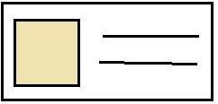
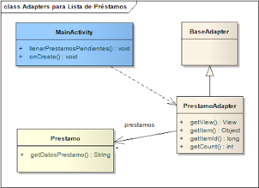

# Lista de préstamos

La primera versión de nuestra pantalla es simple

* Layout lineal
* ListView de préstamos como un content: en las versiones más nuevas de Android se reemplaza por un [**Recycler View**](https://developer.android.com/guide/topics/ui/layout/recyclerview)

```xml
<LinearLayout xmlns:android="http://schemas.android.com/apk/res/android"
    xmlns:tools="http://schemas.android.com/tools"
    android:id="@+id/TableLayout1"
    android:layout_width="match_parent"
    android:layout_height="match_parent"
    android:orientation="vertical"
    tools:context=".MainActivity">

    <ListView
        android:id="@+id/lvPrestamos"
        android:layout_width="match_parent"
        android:layout_height="wrap_content"
        android:paddingLeft="@dimen/activity_horizontal_margin"
        android:paddingRight="@dimen/activity_horizontal_margin"
        android:choiceMode="singleChoice"
        ></ListView>

</LinearLayout>
```

### Layout

Al definir el layout en el ancho (width) y alto (height):

* para el ancho del textview que muestra la información de un libro consideraremos el tamaño de la pantalla: match_parent
* para el alto, nos interesa que aparezca toda la información del libro sin truncar, por eso usamos wrap_content

## Controller

El juego de datos se inicializa a partir de una lista de préstamos, que creamos en el singleton PrestamosAppBootstrap y que pueden ver en caso de interés.

## Adapter entre ListView y la lista de préstamos

```kt
private fun llenarPrestamosPendientes() {
    val prestamoAdapter = PrestamoAdapter(this, ArrayList(repoPrestamos.getPrestamosPendientes()))
    (lvPrestamos as ListView).adapter = prestamoAdapter
}
```

Esto permite asociar la lista de elementos de la ListView con un conjunto de datos:

El PrestamoAdapter permite que por cada préstamo visualicemos:

* la imagen del contacto al que le prestamos el libro
* el título del libro
* la fecha y el nombre del contacto

### Layout de un préstamo como fila

Creamos un nuevo xml (parados sobre res/layout hacemos new Android XML File) que define la vista de cada fila. La llamamos prestamo_row.xml:

```xml
<?xml version="1.0" encoding="utf-8"?>
<LinearLayout xmlns:android="http://schemas.android.com/apk/res/android"
    android:layout_width="match_parent"
    android:layout_height="wrap_content"
    android:orientation="vertical"
    >

    <LinearLayout
        android:layout_width="match_parent"
        android:layout_height="match_parent"
        android:padding="@dimen/activity_horizontal_margin"
        android:orientation="horizontal"
        >

        <ImageView
            android:id="@+id/imgContacto"
            android:layout_width="wrap_content"
            android:layout_height="wrap_content"
            android:layout_alignParentLeft="true"
            android:layout_centerHorizontal="true"
            android:layout_centerVertical="true"
            android:layout_margin="3dp"/>

        <LinearLayout
            android:layout_width="wrap_content"
            android:layout_height="wrap_content"
            android:orientation="vertical">

            <TextView
                android:id="@+id/txtLibro"
                android:layout_width="wrap_content"
                android:layout_height="match_parent"
                android:textAppearance="?android:attr/textAppearanceMedium" />

            <TextView
                android:id="@+id/txtPrestamo"
                android:layout_width="wrap_content"
                android:layout_height="wrap_content"
                android:textColor="@android:color/black"
                android:textAppearance="?android:attr/textAppearanceSmall" />

        </LinearLayout>

    </LinearLayout>

    <View
        android:layout_width="match_parent"
        android:layout_height="2dp"
        android:background="@android:color/darker_gray" />

</LinearLayout>
```

Para eso definimos un primer layout que será horizontal, donde ubicaremos la foto del contacto. Luego otro layout vertical permitirá que pongamos la descripción del libro y los datos del préstamo con un tamaño más chico (textAppearanceSmall).



### Controller de la fila de un préstamo

La clase PrestamoAdapter por un lado conoce a la lista de préstamos pendientes (una lista **mutable**), pero también ajusta el contenido de un préstamo al xml que acabamos de definir:

```kt
class PrestamoAdapter(_mainActivity: Activity, _prestamosPendientes: MutableList<Prestamo>) : BaseAdapter() {

    val prestamosPendientes : MutableList<Prestamo> = _prestamosPendientes
    val mainActivity : Activity = _mainActivity

    override fun getCount(): Int {
        return prestamosPendientes.size
    }

    override fun getItem(position: Int): Any {
        return prestamosPendientes.get(position)
    }

    override fun getItemId(position: Int): Long {
        return position.toLong()
    }

    override fun getView(position: Int, convertView: View?, parent: ViewGroup): View {
        val prestamo = getItem(position) as Prestamo
        val inflater = mainActivity.getSystemService(Context.LAYOUT_INFLATER_SERVICE) as LayoutInflater
        val row = inflater.inflate(R.layout.prestamo_row, parent, false)
        val lblLibro = row.findViewById(R.id.txtLibro) as TextView
        val lblPrestamo = row.findViewById(R.id.txtPrestamo) as TextView
        val imgContacto = row.findViewById(R.id.imgContacto) as ImageView
        lblLibro.text = prestamo.libro.toString()
        lblPrestamo.text = prestamo.datosPrestamo
        ImageUtil.assignImage(prestamo.contacto!!, imgContacto)
        return row
    }
}
```

Mientras que en otros ejemplos utilizamos un Recycler View, aquí desacoplamos el objeto que adapta la vista de una fila de la actividad principal (`MainActivity.kt`). [Pueden estudiar una comparación de ambas formas de visualizar colecciones en Android aquí.](https://stackoverflow.com/questions/26728651/recyclerview-vs-listview).


