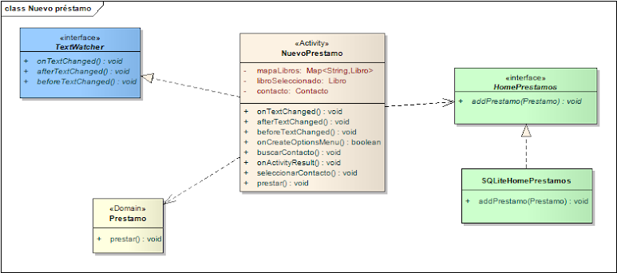
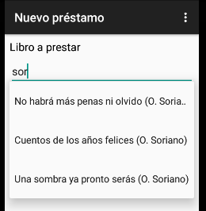
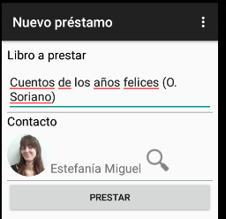

# Nuevo préstamo

## Nuestro objetivo

Definir la actividad que permita cargar un nuevo préstamo.

## Pasos

* seleccionar el libro que uno está prestando, mediante una búsqueda rápida que muestra las opciones a medida que va escribiendo
* seleccionar el contacto 
* la fecha se asume la del día de hoy
    * **BONUS:** que sea posible cambiarla mediante un control calendario
* agregar el préstamo en la lista y cerrar la actividad

## Persistencia

Toda esta información queda en memoria mientras dura la aplicación o se persiste en un SQL Lite, teniendo en cuenta que 

1. la relación many-to-one entre las entidades Préstamo y Libro. En la tabla Préstamo se almacena el identificador unívoco de Libro (LIBRO_ID según vimos). 
2. la relación many-to-one contra los contactos, que se guardan en el dispositivo. La referencia al contacto puede ser el ID (que podría re-mapearse al RAW_CONTACT_ID), el teléfono (PHONE), o bien el nombre del contacto. En el ejemplo elegimos la segunda opción para no tener que hacer tantos cambios en la aplicación. 

## Vista

Definimos un LinearLayout vertical, donde

* en la primera línea utilizamos un control **AutoCompleteTextView** txtLibroTituloAutocomplete, le incorporamos la propiedad hint para dar una idea al usuario de lo que tiene que seleccionar
* para mostrar los datos del contacto en una sola línea, generamos un **LinearLayout** horizontal. Es importante que el ancho y alto se configuren wrap_content, para que traten de ocupar el máximo ancho posible de la línea, pero dejen espacio al botón que está abajo. En esta línea se ubican
    * un **ImageView** imgContacto que muestre la foto del contacto
    * un **TextView** txtContacto  que muestre la información del contacto: esto puede ser sólo nombre o podría incluir algún dato de contacto
    * un **ImageButton** btnBuscar que dispare la app búsqueda de contactos del dispositivo
    * si no tenemos un contacto seleccionado, la imagen y el texto se ocultan
* un **Button** btnPrestar que dispare la acción que crear el nuevo préstamo, en el atributo onClick = prestar.

## Controller

### Búsqueda con Autocomplete

En el onCreateOptionsMenu de la actividad le pasamos al control autocomplete la lista de libros pendientes:

```kt
    val libros = PrestamosConfig.repoLibros(this).librosPrestables()
    for (libro in libros) {
        mapaLibros.put(libro.toString(), libro)
    }
    txtLibroTituloAutocomplete.setAdapter(ArrayAdapter<Libro>(this, android.R.layout.simple_dropdown_item_1line, libros))
    txtLibroTituloAutocomplete.addTextChangedListener(this)
```

Como el toString() de Libro concatena título y autor la estrategia que adoptamos es crear un mapa cuya clave será el toString de libro y cuyo valor es el objeto Libro (una estrategia un tanto heterodoxa porque no manejamos objetos seleccionados como cuando disponemos de binding).

La Activity implementa TextWatcher, entonces podemos capturar el evento onTextChanged para hacer la búsqueda en el mapa de libros en base al valor ingresado:

```kt
override fun onTextChanged(s: CharSequence, start: Int, before: Int, count: Int) {
    libroSeleccionado = mapaLibros.get(txtLibroTituloAutocomplete.text.toString())
}
```

Si escribimos algo que no está en el mapa la variable libroSeleccionado quedará en null.

### Búsqueda de contactos

Al hacer click en el botón se dispara un intent a la aplicación de búsqueda de contactos que trae el dispositivo

```kt
fun buscarContacto(view: View) {
    val intent = Intent(Intent.ACTION_PICK, ContactsContract.Contacts.CONTENT_URI)
    startActivityForResult(intent, PICK_CONTACT)
}
```

Una vez que seleccionamos un contacto, hay que capturar el evento como callback:

```kt
override fun onActivityResult(reqCode: Int, resultCode: Int, data: Intent) {
    when (reqCode) {
        PICK_CONTACT -> {
            if (resultCode === Activity.RESULT_OK) {
                seleccionarContacto(data)
            }
        }
    }
}

private fun seleccionarContacto(data: Intent) {
    val loader = CursorLoader(this, data.getData(), null, null, null, null)
    val cursor = loader.loadInBackground()!!
    if (cursor.moveToFirst()) {
        val name = cursor.getString(cursor.getColumnIndexOrThrow(ContactsContract.Contacts.DISPLAY_NAME))
        val contactoBuscar = Contacto(null, null, name, null, null)
        // http://developer.android.com/reference/android/os/StrictMode.html
        contacto = PrestamosConfig.repoContactos(this).getContacto(contactoBuscar)!!
        txtContacto.text = contacto!!.nombre
        ImageUtil.assignImage(contacto!!, imgContactoAPrestar)
    }
}
```

En el método seleccionarContacto recibimos un cursor, con el que generamos contactoBuscar, el objeto Contacto que nos sirve de prototipo para hacer la búsqueda al home de Contactos que ya diseñamos. La ventaja es que el home nos devuelve un Contacto ya construido, solamente tenemos que encargarnos del binding de la imagen con la foto y el textview con los datos del contacto.

### Prestar

Al prestar hay que instanciar un préstamo con 

* el libro seleccionado, que lo tenemos en una variable de instancia _libroSeleccionado_ (se carga en el método onTextChanged del autocomplete)
* el contacto seleccionado, que lo tenemos también en una variable local _contacto_ (se carga en el método seleccionarContacto)

luego delegar al repositorio y cerrar la actividad. Si hay errores de validación, se muestra un Toast al usuario y se corta el flujo (la actividad no se cierra ni se agrega el préstamo). Si hay un error diferente (de programación), el mensaje es diferente

```kt
fun prestar(view: View) {
    try {
        val prestamo = Prestamo(null,  contacto, libroSeleccionado)
        prestamo.prestar()
        PrestamosConfig.repoPrestamos(this).addPrestamo(prestamo)
        PrestamosConfig.repoLibros(this).updateLibro(libroSeleccionado!!)
        this.finish()
    } catch (be: BusinessException) {
        Toast.makeText(this, be.message, Toast.LENGTH_SHORT).show()
    } catch (e: Exception) {
        Log.e("Crear prestamo", e.message)
        e.printStackTrace()
        Toast.makeText(this, "Ocurrió un error. Consulte con el administrador del sistema.", Toast.LENGTH_SHORT).show()
    }
}
```

Por último hay que indicar en el MainActivity que refresque la lista de préstamos al reactivarse la actividad:

```kt
override fun onResume() {
    super.onResume()
    this.llenarPrestamosPendientes()
}
```

## Diagrama de clases de la solución



## Ejecutando la aplicación

Vemos cómo queda el resultado final.


