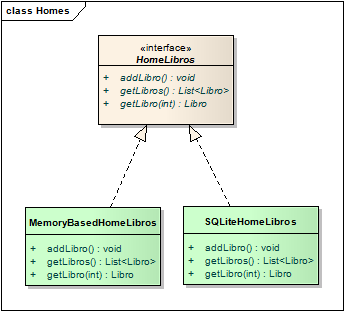
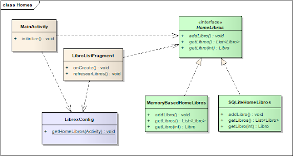

# Persistencia a un medio local

Entre los recursos disponibles de los dispositivos contamos con una API que permite persistir la información localmente, gracias a un motor que soporta el modelo relacional llamado [SQLite](https://www.sqlite.org/index.html).

Algunas características de este motor son:

* es liviano, sólo necesita 250K de memoria para ejecutarse
* no sólo funciona sino que además viene embebido en la VM de Android (ART)
* es open-source
* su distribución es gratuita
* como dijimos antes es un motor relacional, que 
* soporta transaccionalidad
* permite definir PRIMARY KEYs
* también claves subrogadas (ID autoincrementales)
* tiene un acotado sistema de tipos, apenas TEXT (String), INTEGER (int o Long), y REAL (double)

Para más detalles recomendamos la lectura de [esta página](http://www.vogella.com/tutorials/AndroidSQLite/article.html).

## Definición de estructuras de las tablas

La aplicación corre en el dispositivo, justamente donde necesitamos generar las tablas en el caso en que no existan. Entonces nuestro primer trabajo es definir un objeto que genere la estructura de las tablas Libros y Préstamos (los contactos ya se persisten cuando usamos el ContentProvider de Contacts):

```kt
class PrestamosAppSQLLiteHelper(context: Context) :
    SQLiteOpenHelper(context, DATABASE_NAME, null, DATABASE_VERSION) {

    /**
     * Script para iniciar la base
     */
    override fun onCreate(db: SQLiteDatabase) {
        var crearTablas = StringBuffer()
        crearTablas.append("CREATE TABLE Libros (ID INTEGER PRIMARY KEY AUTOINCREMENT,")
        crearTablas.append(" TITULO TEXT NOT NULL,")
        crearTablas.append(" AUTOR TEXT NOT NULL,")
        crearTablas.append(" PRESTADO INTEGER NOT NULL);")
        db.execSQL(crearTablas.toString())

        crearTablas = StringBuffer()
        crearTablas.append("CREATE TABLE Prestamos (ID INTEGER PRIMARY KEY AUTOINCREMENT,")
        crearTablas.append(" LIBRO_ID INTEGER NOT NULL,")
        crearTablas.append(" CONTACTO_PHONE TEXT NOT NULL,")
        crearTablas.append(" FECHA TEXT NOT NULL,")
        crearTablas.append(" FECHA_DEVOLUCION TEXT NULL);")
        db.execSQL(crearTablas.toString())

    }

    ...
}
```

Los métodos que definimos son:

* **onCreate:** el evento que se dispara la primera vez que se crea la base de datos
* **onUpgrade:** cuando se sube la versión de la base de datos, la estrategia (discutible) es eliminar las tablas libros y préstamos y volverlos a recrear. Tendríamos que analizar otras variantes si la información es sensible. Teniendo en cuenta que la app tiene fines didácticos no nos detenemos en este punto.

## Un nuevo hogar para los libros

Hasta el momento teníamos:

* una interfaz RepoLibros
* y una implementación concreta MemoryBaseHomeLibros

lo cual parecía una solución un tanto sobrediseñada. No obstante aquí vamos a generar una nueva clase Home, que va a terminar enviando mensajes a la base de datos local



## Implementación del repositorio de libros

* la alternativa más sencilla es definir una clase que implemente el repositorio de libros
* otra opción es implementar un ContentProvider que termine generando los queries de insert, update, delete y select a la base, pero eso agrega un grado más de indirección, con su correspondiente complejidad

### Alta de un libro

Veamos cómo se codifica el alta de un libro:

```kt
    override fun addLibro(libro: Libro) {
        val con = db.writableDatabase
        var prestado = 0
        if (libro.estaPrestado()) {
            prestado = 1
        }
        val values = ContentValues()
        values.put("id", libro.id)
        values.put("titulo", libro.titulo)
        values.put("autor", libro.autor)
        values.put("prestado", prestado)

        con.insert("Libros", null, values)
        Log.w("Librex", "Se creó libro $libro")
    }
```

 Tenemos que mapear cada atributo del libro con su correspondiente campo en la tabla Libros. Como los atributos son pocos y además utilizan tipos primitivos (Strings) no parece haber mucho trabajo, pero nos imaginamos que al persistir el préstamo (que tiene una relación con un objeto Libro) la cosa no va a ser tan sencilla.

### Búsqueda de un libro

Ahora resolveremos la búsqueda de libros en la base:

```kt
    override fun libros(): List<Libro> {
        val con = db.readableDatabase
        val result = ArrayList<Libro>()

        val curLibros = con.query("Libros", CAMPOS_LIBRO, null, null, null, null, null)
        while (curLibros.moveToNext()) {
            result.add(crearLibro(curLibros))
        }
        Log.w("Librex", "getLibros | result: $result")
        return result
    }
```

La query hace una búsqueda _by example_ pasando valores para cada uno de los campos.

### Modificaciones en la configuración

Modificamos el objeto que permite configurar los repositorios para la aplicación

```kt
object PrestamosConfig {
    fun repoLibros(activity: Activity): RepoLibros {
        // PERSISTENTE
        return SQLLiteRepoLibros(activity)
        // NO PERSISTENTE
        // return CollectionBasedLibros
    }
```

La clase PrestamosBootstrap no cambia nada, porque la variable repoLibros toma el tipo RepoLibros genérico:

```kt
val repoLibros = PrestamosConfig.repoLibros(activity)

// Cuando necesitemos generar una lista nueva de libros
// homeDeLibros.eliminarLibros()
elAleph = repoLibros.addLibroSiNoExiste(elAleph)
laNovelaDePeron = repoLibros.addLibroSiNoExiste(laNovelaDePeron)
cartasMarcadas = repoLibros.addLibroSiNoExiste(cartasMarcadas)
```

## Diagrama general de las clases



## Repositorios polimórficos

Para que el lector compruebe que los repositorios son efectivamente polimórficos, se puede volver atrás la configuración del home de libros:

```kt
object PrestamosConfig {
    fun repoLibros(activity: Activity): RepoLibros {
        // PERSISTENTE
        // return SQLLiteRepoLibros(activity)
        // NO PERSISTENTE
        return CollectionBasedLibros
    }
```

Y vemos que el comportamiento para actualizar los libros se mantienen, funcionando los homes en forma polimórfica para las actividades y fragments. Dejamos para que el lector investigue en el ejemplo cómo se resuelve la persistencia de los préstamos.
